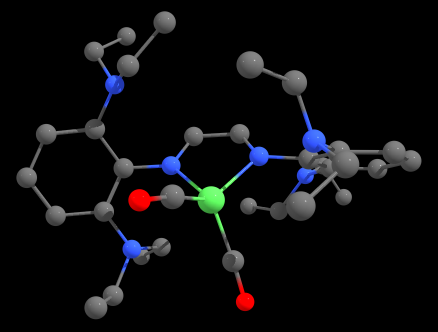

<h1 align="center">ligands-ML ⚛️📊</h1>

  
  

> Experiments in applying machine learning and chemometrics to ligand design for transition metal catalysts.

### 🏠 [Homepage](https://github.com/pmwaddell/ligands-ML)

## Setup (WORK IN PROGRESS!)

Things that are needed:

* rdkit, basically everything in the rdkit-env environment except like autode I think.
* ORCA (make sure you check the parallel option), with the absolute path indicated in config.yaml.
* Microsoft MPI

* Separate environment for DBSTEP, potentially. That's how I'm doing it now, at least. But we may not even end up using it.

## Author

👤 **Peter Waddell**

* Website: https://github.com/pmwaddell
* Github: [@pmwaddell](https://github.com/pmwaddell)
* LinkedIn: [@https:\/\/www.linkedin.com\/in\/peter-waddell-ph-d-00b95265\/](https://linkedin.com/in/https:\/\/www.linkedin.com\/in\/peter-waddell-ph-d-00b95265\/)

## Show your support

Give a ⭐️ if this project helped you!

## 📝 License

Copyright © 2024 [Peter Waddell](https://github.com/pmwaddell). 
This project is [MIT](https://www.mit.edu/~amini/LICENSE.md) licensed.
